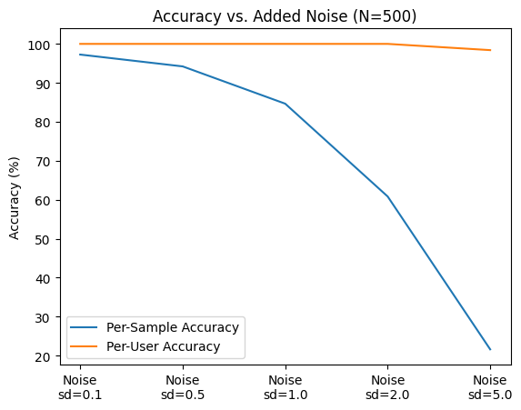
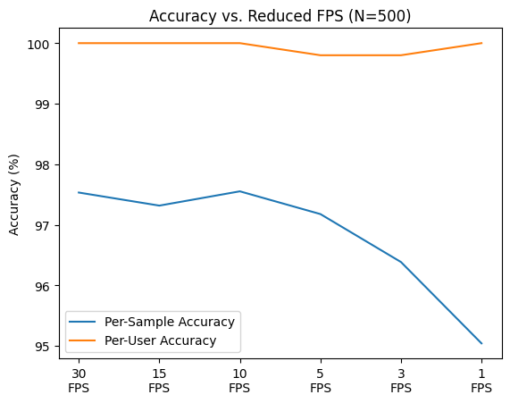
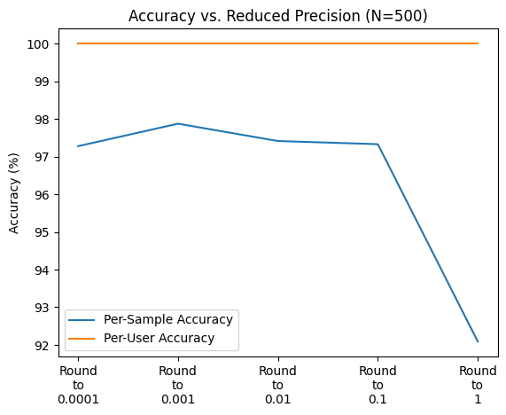
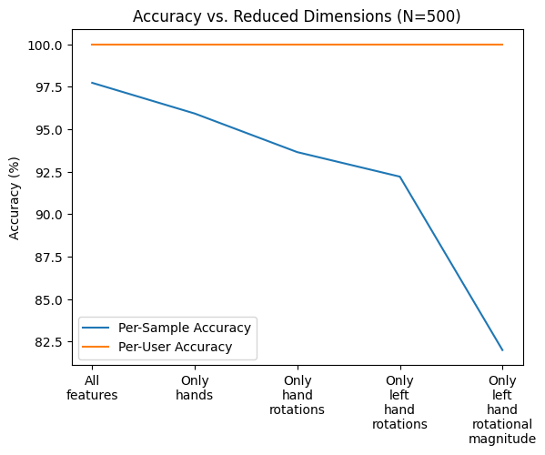

### Testing the robustness of motion-based identification in VR

#### Dependencies
We used Python v3.10.2 on Windows 10 for training and testing all components of our system. The names and recommended versions of all Python dependencies are listed below. No other platforms or versions are officially supported.
- numpy v1.25.1
- pandas v1.4.3
- tqdm v4.64.0
- tensorflow v2.10.1
- matplotlib v3.5.2

#### Dataset
Training and testing this system requires use of the Berkeley Open Extended Reality Recording Dataset 2023 (BOXRR-23) dataset, available for free at https://rdi.berkeley.edu/metaverse/boxrr-23/.

#### Results

Copyright &copy;2023 Berkeley RDI -- License [BSD](https://github.com/metaguard/robustness/blob/main/LICENSE)

_We appreciate the support of Meta Platforms, the Minderoo Foundation, the National Science Foundation, the National Physical Science Consortium, the Fannie and John Hertz Foundation, and the Berkeley Center for Responsible, Decentralized Intelligence._
